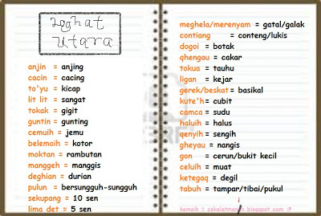

# WriteUp-3108CTF
---------------------------------------------------------------------------
# __Kategori__

- [**Jalur Gemilang**](#Jalur-Gemilang) 
    - [**3108**](#jalur-gemilang--3108)
    - [**Cordini 🧩**](#jalur-gemilang--Cordini-)

- [**Selangor**](#Selangor) 
    - [**Mesej Rahsia**](#selangor--Mesej-Rahsia)
    
- [**Kelantan**](#Kelantan) 
    - [**Sultan Yang Hilang**](#kelantan--Sultan-Yang-Hilang)
    
- [**Johor**](#Johor) 
    - [**zZzZz 🕸️+🧮**](#johor--zZzZz-)

- [**Melaka**](#Melaka) 
    - [**Perigi 🔍**](#melaka--Perigi-🔍)
    - [**Pahlawan Lagenda 🕵🏻‍♀️**](#melaka--Pahlawan-Lagenda-)

- [**Sarawak**](#sarawak) 
    - [**Makanan Popular 🐧**](#sarawak--Makanan-Popular-)
    
- [**Pulau Pinang**](#Pulau-Pinang) 
    - [**Mamu Kasi Tau 🧩**](#pulau-pinang--Mamu-Kasi-Tau-)
    
- [**Perak**](#Perak) 
    - [**Pandak Lam 🧮**](#perak--Pandak-Lam-)
    
- [**Kedah**](#Kedah) 
    - [**Wordle Bahasa Utaqa**](#kedah--Wordle-Bahasa-Utaqa)

- [**Negeri Sembilan**](#Negeri-Sembilan) 
    - [**Jauh Bono Umohnyo 🧩**](#negeri-sembilan--Jauh-Bono-Umohnyo-)
    
---------------------------------------------------------------------------

## Jalur Gemilang
- ### Jalur Gemilang : 3108


Untuk Tugasan ini , Cuma masukkan "<b>Ya</b>" Pada Kotak Jawapan

- ### Jalur Gemilang : Cordini 🧩

Untuk Tugasan ini, memerlukan <a href="https://github.com/BetterDiscord/Installer">Better Discord</a> & <a href="https://github.com/JustOptimize/ShowHiddenChannels">ShowHiddenChannels</a>

Simply Follow Instruction Installation pada Github BetterDiscord dan ShowHiddenChannels 


Kemudian Pada Discord Server 3108 akan terpapar Hidden Channel pada Server tersebut seperti Bendera Percuma
Untuk mendapatkan access, React pada message di Channel ```#get-role```,
Setelah mendapatkan access, akan terpapar flag untuk Soalan ```Cordini 🧩```

Flag : 3108{kibarkanlah_jalur_gemilang}

## Selangor
- ### Selangor : Mesej Rahsia

Untuk Tugasan ini kita dibekalkan dengan script python ```secretmessenger.py```.

```bash
a,b,c,d,e,f,g,h,i,j,k,l,m,n,o,p,q,r,s,t,u,v,w,x,y,z='j','b','a','c','m','n','i','p','o','q','r','t','x','z','v','s','u','y','h','g','d','e','f','k','l','w'
flag=((3108,"{",p,q,b,p,l,g,l,q,l,v,"_",d,g,h,s,v,k,"_",l,v,m,l,"}")[::-1])
```
*Ini code dalam script python*

Macam something dengan variable pada script ni. 
Jadi mari kita break it down the data type dengan values : 

```
Data-Type : a,b,c,d,e,f,g,h,i,j,k,l,m,n,o,p,q,r,s,t,u,v,w,x,y,z
Values : 'j','b','a','c','m','n','i','p','o','q','r','t','x','z','v','s','u','y','h','g','d','e','f','k','l','w'

```
Memandangkan ianya adalah Python Script, kita complete kan code untuk dapat kan flag


The Output Will Shown like this 


Jadi flag kita : ```3108{substitution_cipher_text}```

## Kelantan
- ### Kelantan : Sultan Yang Hilang


Untuk tugasan ini, kita diberikan [pautan](https://f2add8dd3a.bahterasiber.my/) yang memaparkan 12 Sultan yang pernah memerintah dari tahun ```1763``` Sehingga ```2010```


Notice theres Api Endpoint and Number on the ```const sultanYears``` selepas View-Source

```bash
<script>
            const sultanYears = [1763, 1795, 1800, 1835, 1837, 1886, 1890, 1899, 1920, 1944, 1960, 1979, 2010];
            
            sultanYears.forEach(year => {
                fetch(`/api/v1/sultan/${year}`)
                    .then(response => response.json())
                    .then(data => {
                        const list = document.getElementById('sultan-list');
                        const listItem = document.createElement('li');
                        if (data.error) {
                            listItem.textContent = `${data.error}`;
                        } else {
                            listItem.textContent = `${data.nama}`;
                        }
                        list.appendChild(listItem);
                    })
                    .catch(error => console.error('Error:', error));
            });
        </script>
```

gunakan ```/api/v1/sultan/``` sebagai directory pada pautan web yang kita dapat tadi : 

> **Note**
> Boleh juga buat script gunakan Api Endpoint maybe it'll be faster then my way :p

```EX : https://f2add8dd3a.bahterasiber.my/api/v1/sultan/```

We refer the number in code ```sultanYears``` as Tahun pemerintahan, every sultan has their period time dalam pemerintahan 
eg : 

```bash
Tahun : 1763 
Pemerintah : Long Yunus
Tahun pemerintahan : 1763 - 1795
```

ini bermaksud pada 1795 Pemerintah baru akan naik menjadi Pemerintah and so does the other Sultan.

Notice there's an odd after put ```1886``` after the directory ../sultan/. 
The output shown as: 

```bash
{
  "id": 1886, 
  "nama": "Sultan Ahmad Tengah ibni Long Senik Mulut Merah", 
  "tahun_pemerintahan": "1886-1889"
}
```

Sultan Ahmad Tengah ibni Long Senik Mulut Merah memerintah pada tahun 1886 sehingga 1889, Meanwhile in the code after ```1886``` is ```1890```.

Put the ```1890``` in the directory shows nothing, but put ```1889``` will give us a Flag


Flag : 3108{putera_sulong_Sultan_Ahmad}

## Johor
- ### Johor : zZzZz 🕸️+🧮

Tugasan kalini dibekalkan dengan [pautan](https://9798fd3cc4.bahterasiber.my/) lead to a website beserta soalan.


do some research tentang siapa yang membunuh Sultan Mahmud pada tahun 1699, The research lead to ```Laksamana Bentan```, after that you will be given Cipher Text

```0x33z0x31z0x30z0x380x7bz0x37z0x30z0x30z0x650x66z0x34z0x61z0x37z0x39z0x39z0x350x39z0x360x31z0x350x62z0x360x37z0x650x61z0x35z0x32z0x39z0x37z0x65z0x37z0x32z0x350x63z0x300x36z0x65z0x7dz```

The Cipher text is actually Hexadecimal Text, remove ```0x``` in the cipher text, then go to [Online Hex To Ascii Converter](https://www.rapidtables.com/convert/number/hex-to-ascii.html)

The Output Will be shown like this : 3108{700ef4a79959615b67ea5297e725c06e}

Flag : 3108{700ef4a79959615b67ea5297e725c06e}

## Melaka
- ### Melaka : Perigi 🔍

Tugasan ini dibekalkan dengan satu compressed file .rar yang memerlukan kita untuk extract namun ada password before dapat extract.


Berpandukan clue yang ada pada soalan, buat sedikit research akan mendapatkan 2 Pelaku yang meracun Perigi tersebut

```bash
tahun 1606 Askar Belanda Meracun Perigi tersebut
Tahun 1628 - 1629 Askar Acheh Meracun Perigi tersebut
```

The password to extract could be either ```Belanda``` or ```Acheh```. Put one of these, then you will get text file named ```flag.txt``` with a flag inside

Flag : 3108{th3_k1ngs_w3ll_st4ys_0n}

- ### Melaka : Pahlawan Lagenda 🕵🏻‍♀️

Tugasan ini kita diberikan satu text file bernama ```Tuah.flag.txt```,Lets try using [grep command](https://www.geeksforgeeks.org/grep-command-in-unixlinux/) untuk cari words ```3108```

> grep -i "3108" Tuah.flag.txt


Flag : 3108{gr3p_15_@w3s0m3_l4ks4m4n4}

## sarawak
- ### Sarawak : Makanan Popular

Tugasan ini , kita diberikan suatu file bernama ```Makanan``` tanpa Extension File

Start tukar-tukar extension seperti ```bash .txt, .png, .jpg, .jpeg```

Image Extension tidak dapat view, so could be .txt , after tukar menjadi ```.txt``` file tersebut akan jadi begini : 


hmmm Looks Suspicious, power up my terminal then using [strings](https://www.howtogeek.com/427805/how-to-use-the-strings-command-on-linux/) to view the file , output shown like this
> strings Makanan.txt > output.txt

The ```>``` akan letakkan output strings Makanan.txt kedalam file output.txt

buka file output.txt , tekan ```Ctrl+f``` cari ```3108``` then you will get the flag or use grep command also work


Flag : 3108{L4KS4_S4R4W4K}

## Pulau Pinang

- ### Pulau Pinang : Mamu Kasi Tau 🧩

Tugasan ini kita dibekalkan dengan suatu audio file mp3, Download file tersebut kemudian dengarkannya.

Dah macam bahasa alien XD 

pergi ke [Audiomass Audio Editor](https://audiomass.co/) , kemudian upload file audio mp3 tadi, dan reverse audio tersebut , dengar dengan teliti

Flag : 3108{peningtelinga}

## Perak 

- ### Perak : Pandak Lam 🧮

Tugasan ini kita diberikan satu file text bernama Sumber_Sekunder.txt
> **Sedikit Fakta Menarik**
> Sumber Sekunder ialah Bahan asli yang belum ditafsir, diolah dan dicetak seperti Fosil, manuskrip lama dan Batu bersurat (^_^)

Content File tersebut telah Di encrypt dengan Caesar Cipher dengan rotation shift 13 atau di beri nama [Rot-13](https://www.geeksforgeeks.org/rot13-cipher/)


Notice Ada number dan perkataan ```3108x3o4atx1gnac4uy4j4a```, Copy this one 

Gunakaan [Online Decode ROT-13](https://www.dcode.fr/rot-13-cipher) Then you'll get the flag

Flag : 3108{k3b4ngk1tanp4hl4w4n}

## Kedah

- ### Kedah : Wordle Bahasa Utaqa 🕸️

> **FYI**
> Wordle is a web-based word game created and developed by Welsh software engineer Josh Wardle. Players have six attempts to guess a five-letter word, with feedback given for each guess in the form of coloured tiles indicating when letters match or occupy the correct position.
> Source : wikipedia

Kita Diberikan Gambar yang mengandungi perkataan loghat Kedah dan [pautan](https://7e6d97fe1f.bahterasiber.my/) Wordle Bahasa Utara



Refer gambar yang diberikan , perasan ada 5 kotak setiap row pada website yang diberikan, jadi kita asingkan perkataan pada gambar yang hanya ada 5 huruf dalam perkataan tersebut

```bash
anjin
cacin
tokak
pulun
dogoi
tokua
ligan
camca
tabuh
```

Letakkan perkataan pada row pertama secara random dan perhatikan huruf yg berkotak hijau
eg : ligan > kotak a hijau, cari perkataan yang huruf ke-4 pada perkataannya ialah a
> Could be different for other words

ulang sehingga dapat perkataan yg betul beserta flag, luck jika dapat flag untuk first try. goodluck

Flag : 3108{h4ng_m3m4ng_s3mp0i}

## Negeri Sembilan

- ### Negeri Sembilan : Jauh Bono Umohnyo 🧩

Tugasan ini kita diberikan sequence of numbers ```777 33 6 22 2 88_6 666 7777 8_9 2 66 8 33 3```, this one could be Multi-Tap Phone Cipher

Pergi ke [Multi-Tap Phone Cipher Online Decoder](https://www.dcode.fr/multitap-abc-cipher)


The Output shown like this REMBAUMOSTWANTED

Flag : 3108{REMBAUMOSTWANTED}

---------------------------------------------------------------------------

# That's All, Maaf Jika ada Kesilapan tatabahasa, ejaan. Maaf jika terlalu sedikit , ini sahaja yang dapat saya lakukan ketika tempoh Pertandingan Berlangsung, this is my first time writting an Write Up for ctf.

# Thank You, Salam sayang dari AmcaQt
